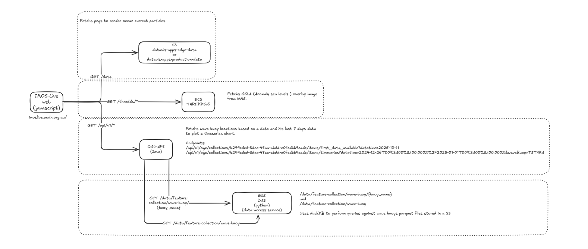

# IMOS Live Frontend - Product Owner Handover Document

## 1. Project Overview

**IMOS Live** is an interactive web application that visualizes oceanographic data for the Australian region. The application provides real-time visualization of ocean currents using WebGL-accelerated particle animations, sea level anomalies, wave buoy data, and sea surface temperature anomalies on an interactive MapBox map.

**Project Name:** imos-mapbox-app (IMOS Live Frontend)

**Primary Purpose:** To make complex oceanographic data accessible and understandable through interactive visualizations, supporting marine research, navigation planning, and environmental monitoring.

**Target Users:**

- Marine researchers and oceanographers
- Maritime industry professionals
- Environmental scientists
- General public interested in ocean conditions

**Current Status:** Active production application deployed to AWS S3/CloudFront

[IMOS Live PROD](https://imoslive.aodn.org.au/)
[IMOS Live EDGE](https://imoslive.edge.aodn.org.au/)

## 2. Key Technologies and Frameworks

### Core Technologies

- **React 19.0.0** - UI framework
- **TypeScript 5.7.2** - Type-safe JavaScript
- **Vite 6.2.0** - Build tool and development server
- **Node.js >= 22.0.0** - Required runtime environment

### Mapping and Visualization

- **Mapbox GL JS 3.11.0** - Interactive mapping platform
- **WebGL** (via TWGL.js 5.5.4) - GPU-accelerated particle rendering
- **Highcharts 12.2.0** - Data visualization charts

### State Management and Data Fetching

- **Zustand 5.0.4** - Lightweight state management
- **TanStack Query (React Query) 5.84.1** - Server state management and data fetching
- **Axios 1.8.4** - HTTP client

### UI and Styling

- **Tailwind CSS 4.1.7** - Utility-first CSS framework
- **Radix UI** - Accessible UI components
- **Lucide React** - Icon library

### Geospatial Processing

- **Turf.js 7.2.0** - Geospatial analysis and calculations

### Testing

- **Vitest 3.1.3** - Unit testing framework
- **Playwright 1.54.1** - End-to-end testing
- **Testing Library** - React component testing

### Development Tools

- **Storybook 8.6.12** - Component development and documentation
- **ESLint** - Code linting
- **Prettier** - Code formatting
- **Husky** - Git hooks for quality control
- **Commitlint** - Conventional commit enforcement

## 3. Main Features and Functionality

### Core Visualization Products



The application supports four main data products (defined in `src/constants/product.ts`):

1. **GSLA Ocean Geostrophic Current**

   - WebGL-accelerated particle animation showing ocean current direction and speed
   - Customizable particle density (1,000 to 100,000 particles)
   - Real-time animation with configurable speed and trail effects
   - Color-coded by velocity (0.01 to 3.0 m/s)

   Pulls the files from bucket:

   - PROD: datavis-apps-prod-data.s3.ap-southeast-2.amazonaws.com
   - EDGE: datavis-apps-edge-data.s3.ap-southeast-2.amazonaws.com

2. **GSLA Anomaly Sea Levels**

   - Heatmap overlay showing sea level anomalies
   - Range: -1.2m to +1.2m
   - Color-coded visualization (dark purple to yellow)
   - Mutually exclusive with SST overlay

   Uses thredds v5: https://thredds5.production.aodn.org.au/thredds/catalog.html

3. **Wave Buoys**

   - Interactive point markers showing wave buoy locations
   - Clustering support for multiple buoys
   - Time-series data visualization via Highcharts
   - Popup details for individual buoys

   Uses OGCAPI -> data-access-service -> wave buoy parquet files

4. **SST Anomaly Mosaic** (Sea Surface Temperature)

   - Temperature anomaly overlay
   - Mutually exclusive with GSLA sea level overlay

   Uses thredds v5: https://thredds5.production.aodn.org.au/thredds/catalog.html

   **Important Workaround:** To address WMS tile generation performance issues, THREDDS v5 downloads and caches the last 31 days of AusTemp data locally inside the ECS instance. Without this local cache, the WMS service takes too long to calculate and serve tiles. The data is synced from `s3://imos-data/IMOS/SRS/AusTemp/ssta` to `/usr/local/tomcat/content/thredds/public/austemp` on the server. This workaround was implemented in [this commit](https://github.com/aodn/imos-thredds-docker/commit/ed7cba9056507b06467e30c2710cff3c2b4f29ed) in the imos-thredds-docker repository.

### User Interface Features

- **Multiple Map Styles:** Dark, Light, Satellite imagery options
- **Date Selection:** Time slider for navigating through last 31 days of data
- **Responsive Design:** Optimized for desktop and mobile devices
- **Interactive Controls:**
  - Particle configuration (count, speed, fade, drop rate)
  - Layer toggling (on/off for each product)
  - Distance measurement tool
  - World boundaries overlay
- **Floating Panel:** Collapsible control panel with features menu
- **URL State Persistence:** Map state saved in URL parameters for sharing
- **Layer Indicators:** Visual indicators showing active data layers

## 4. Project Structure and Organization

```
imos-live-frontend/
├── src/
│   ├── api/              # API client functions for data fetching
│   │   ├── oceanCurrent.ts    # GSLA data API
│   │   ├── waveBuoys.ts       # Wave buoy data API
│   │   ├── threddsCatalog.ts  # THREDDS catalog API
│   │   └── instance.ts        # Axios instances
│   ├── assets/           # Images and static assets
│   ├── components/       # React components (26+ components)
│   │   ├── MapComponent/      # Main map component
│   │   ├── DateSlider/        # Date selection UI
│   │   ├── FloatingPanel/     # Draggable control panel
│   │   ├── ColorScaleBar/     # Legend components
│   │   └── ...               # UI components (Button, Drawer, etc.)
│   ├── config/           # Configuration files
│   │   ├── particleConfig.ts  # Particle animation settings
│   │   ├── layerConfig.ts     # Map layer configurations
│   │   └── reactQueryConfig.ts # API query settings
│   ├── constants/        # Application constants
│   │   ├── product.ts         # Product definitions
│   │   └── map.ts            # Map-related constants
│   ├── helpers/          # Utility helper functions (13 files)
│   ├── hooks/            # Custom React hooks (30+ hooks)
│   ├── layers/           # MapBox custom layers
│   │   ├── VectorField.js     # WebGL particle system
│   │   └── vectorLayer.ts     # Vector layer integration
│   ├── pages/            # Page components
│   │   └── Map.tsx           # Main map page
│   ├── routes/           # Routing configuration
│   ├── store/            # Zustand state stores
│   │   ├── useMapUIStore.ts   # Map UI state
│   │   └── useDrawerStore.ts  # Drawer state
│   ├── styles/           # Style configurations
│   ├── types/            # TypeScript type definitions
│   └── utils/            # Utility functions (25+ files)
├── doc/                  # Documentation
│   ├── DataProcessing.md     # Data processing documentation
│   └── TechnicalDoc.md       # Technical implementation details
├── public/               # Static assets
├── tests/                # E2E tests
└── .github/workflows/    # CI/CD pipelines
```

**Architecture Pattern:** Component-based architecture with:

- Single page application (SPA)
- Feature-based folder organization
- Custom hooks for business logic
- Centralized state management with Zustand

## 5. Important Configuration Files

### Environment Configuration

- **`.env.local`** - Local environment variables:
  - `VITE_MAPBOX_KEY` - Mapbox API key
  - `VITE_S3_BASE_URL` - Data source base URL

### Build Configuration

- **`vite.config.ts`** - Vite build configuration
  - Development proxies for API and S3 data
  - Mock data server for development: `npm run dev:mock`
  - Bundle optimization (code splitting, tree shaking)
  - Google Analytics integration

### TypeScript Configuration

- **`tsconfig.json`** - TypeScript settings
  - Path aliases: `@/*` → `./src/*`
  - Strict type checking enabled

### Styling Configuration

- **`tailwind.config.js`** - Tailwind CSS customization
  - Custom color palette (imos-white, imos-black, imos-red, etc.)
  - Dark mode support

### Code Quality

- **`eslint.config.js`** - Linting rules
- **`.prettierrc`** - Code formatting rules
- **`commitlint.config.mjs`** - Commit message conventions
- **`.husky/`** - Git hooks for pre-commit checks

### Testing

- **`vitest.workspace.ts`** - Unit test configuration
- **`playwright.config.ts`** - E2E test configuration

### Component Development

- **`.storybook/`** - Storybook configuration for component library

## 6. Existing Documentation

### Primary Documentation Files

1. **`README.md`**

   - Overview of the ocean current visualization system
   - Key features and core components
   - Setup and installation instructions
   - Environment variable requirements
   - Mock data development mode
   - Performance considerations

2. **`doc/DataProcessing.md`**

   - Detailed documentation on data processing pipeline
   - NetCDF data format and structure
   - GSLA dataset description (from IMOS S3 archive)
   - Image generation process (overlay and input PNGs)
   - Metadata JSON format
   - Python script workflow

3. **`doc/TechnicalDoc.md`**
   - System architecture overview
   - Data processing pipeline details
   - WebGL particle visualization implementation
   - Shader-based animation techniques
   - MapBox integration details
   - Configuration parameters

### GitHub Templates

- **`.github/ISSUE_TEMPLATE/bug-fixing-template.md`** - Bug report template
- **`.github/ISSUE_TEMPLATE/feature_request.md`** - Feature request template

### Development Setup

- Node.js >= 22.0.0 required
- Install: `npm install`
- Development: `npm run dev` (with real data) or `npm run dev:mock` (with mock data)
- Build: `npm run build`
- Test: `npm test` (unit) and `npm run test:e2e` (E2E)

## 7. Dependencies and External Services

### Data Sources

1. **IMOS S3 Archive (AWS)**

   - **Purpose:** Primary data source for oceanographic data
   - **Data:** Gridded Sea Level Anomaly (GSLA) NetCDF files
   - **Location:** `s3://imos-data/IMOS/OceanCurrent/GSLA/NRT/`
   - **Format:** NetCDF with UCUR, VCUR, GSLA variables
   - **Coverage:** Australia region (110°E to 170°E, -50°S to 0°S)

2. **Static Data Server**

   - **URL:** `https://imoslive.edge.aodn.org.au/data`
   - **Purpose:** Serves processed data files (PNG images and JSON metadata)
   - **Files per date:**
     - `gsla_overlay.png` - Sea level anomaly heatmap
     - `gsla_input.png` - Velocity field texture
     - `gsla_meta.json` - Metadata (lat/lon bounds, velocity ranges)

3. **AODN Portal API**

   - **Endpoint:** `https://portal.edge.aodn.org.au/api/v1/ogc`
   - **Purpose:** Wave buoy data via OGC API
   - **Collections:**
     - Wave buoy locations (first_data_available)
     - Time-series data (items/timeseries)

4. **THREDDS Catalog**
   - **Endpoint:** `https://imoslive.edge.aodn.org.au/thredds`
   - **Purpose:** Access to NetCDF catalog files

### Third-Party Services

1. **Mapbox**

   - **API Key Required:** Yes (VITE_MAPBOX_KEY)
   - **Purpose:** Base map rendering, map styles, geocoding
   - **Styles Used:** Dark, Light, Satellite (ESRI World Imagery)

2. **Google Analytics** (Optional)
   - **Measurement ID:** VITE_GA_MEASUREMENT_ID
   - **Purpose:** User analytics and tracking
   - **Integration:** Injected via Vite plugin

### Backend Data Processing

The application relies on a **Python data processing script** (separate repository/service) that:

- Fetches NetCDF files from IMOS S3
- Generates PNG textures and overlays
- Creates metadata JSON files
- Runs as a scheduled task (daily)
- Outputs files to the static data server

**Note:** The frontend is **read-only** - it does not modify or write data.

### CDN and External Libraries

- All npm dependencies are pulled from npm registry
- Mapbox GL JS styles and fonts from Mapbox CDN
- No other external CDNs used (all bundled)

## 8. Build and Deployment Information

### Build Process

**Build Scripts:**

```bash
npm run build          # Production build
npm run build:stats    # Build with bundle analysis
npm run preview        # Preview production build locally
```

**Build Output:**

- Location: `/dist` directory
- Static files optimized and minified
- Code splitting:
  - `mapbox` chunk - Mapbox GL library
  - `vendor` chunk - All other node_modules (except Highcharts)
  - Highcharts loaded separately
  - Main application chunks

**Build Requirements:**

- Node.js >= 22.0.0
- Environment variables must be set during build:
  - `VITE_S3_BASE_URL`
  - `VITE_MAPBOX_KEY`
  - `VITE_GA_MEASUREMENT_ID` (optional)
  - `VITE_FEEDBACK_ENABLED` (optional)

### CI/CD Pipeline

**GitHub Actions Workflows:**

1. **Pull Request Checks** (`.github/workflows/pr-checks.yml`)

   - Triggers: PRs to `main` or `dev` branches
   - Steps:
     - Checkout code
     - Setup Node.js
     - Install dependencies (`npm ci`)
     - Run linter (`npm run lint`)
     - Run build (`npm run build`)
     - Run tests (`npm t`)

2. **Edge Deployment** (`.github/workflows/build-deploy-edge.yml`)

   - Triggers: Push to `main` branch
   - Deploys to: Edge environment
   - Uses: Reusable build-deploy workflow

3. **Production Deployment** (`.github/workflows/build-deploy-prod.yml`)

   - Triggers: Push tags matching `v*.*.*` (e.g., v1.0.0)
   - Deploys to: Production environment
   - Uses: Reusable build-deploy workflow

4. **Reusable Build-Deploy Workflow** (`.github/workflows/build-deploy.yml`)

   - Environment-agnostic workflow
   - Steps:
     1. Build job:
        - Setup Node.js (from package.json)
        - Install dependencies
        - Build with environment variables from GitHub secrets
        - Upload build artifact
     2. Deploy job:
        - Download build artifact
        - Configure AWS credentials (OIDC)
        - Sync files to S3 bucket
        - Invalidate CloudFront cache

5. **Playwright E2E Tests** (`.github/workflows/playwright.yml`)
   - E2E testing automation

### Deployment Infrastructure

**Platform:** AWS

**Components:**

1. **S3 Bucket** - Static website hosting

   - Files synced from GitHub Actions
   - Delete old files during sync (`--delete` flag)

2. **CloudFront Distribution** - CDN

   - Cache invalidation after each deployment
   - Global edge locations for performance

3. **AWS IAM Roles** - OIDC authentication
   - GitHub Actions authenticates via OpenID Connect
   - No long-lived AWS credentials needed

**Environment Variables (GitHub Secrets):**

- `AWS_REGION` - AWS deployment region
- `AWS_ROLE_ARN` - IAM role for deployment
- `BUCKET` - S3 bucket name
- `DISTRIBUTION_ID` - CloudFront distribution ID
- `S3_BASE_URL` - Data source URL
- `MAPBOX_KEY` - Mapbox API key
- `VITE_GA_MEASUREMENT_ID` - Google Analytics ID

**Deployment URLs:**

- Edge: `https://imoslive.edge.aodn.org.au/`
- Production: Triggered by version tags

### Development Workflow

**Local Development:**

```bash
npm run dev        # Development with real data (requires VITE_S3_BASE_URL)
npm run dev:mock   # Development with mock data (no backend required)
```

**Development Features:**

- Hot Module Replacement (HMR)
- Proxy configuration for API and S3 requests
- Mock data server for offline development
- Fast refresh for React components

**Quality Gates:**

- Pre-commit hooks:
  - ESLint auto-fix
  - Prettier formatting
  - Staged files only
- Commit message validation (conventional commits)
- PR checks before merge

### Release Process

1. Development on feature branches
2. PR to `main` branch
3. PR checks must pass (lint, build, tests)
4. Merge to `main` → Automatic deployment to Edge
5. Create version tag (e.g., `v1.0.0`) → Automatic deployment to Production

---

## Summary for Product Owner

**IMOS Live** is a modern, production-ready web application that transforms complex oceanographic data into accessible visualizations. The application successfully integrates:

- **Real scientific data** from IMOS archives
- **Advanced visualization** using WebGL particle systems
- **Modern web technologies** (React, TypeScript, Vite)
- **Automated CI/CD** for reliable deployments
- **Responsive design** for desktop and mobile users
- **Performance optimization** for handling large datasets

**Key Success Factors:**

- Well-documented codebase with technical documentation
- Comprehensive testing infrastructure
- Automated quality checks and deployments
- Mock data mode for development without dependencies
- Modular architecture supporting future enhancements

**Technical Debt & Considerations:**

- Dependency on external data processing pipeline (Python scripts)
- Requires coordination with backend team for data updates
- Mapbox API key is a paid service (usage monitoring needed)
- Node.js version requirement is strict (>=22.0.0)

**Recent Updates (from git history):**

- Particle configuration customization (#134)
- Date slider showing last 31 days (#133)
- Product error checking improvements (#132)
- Image rendering fixes (#131)
- Mobile UI improvements (#130)

This application is actively maintained and ready for production use.
