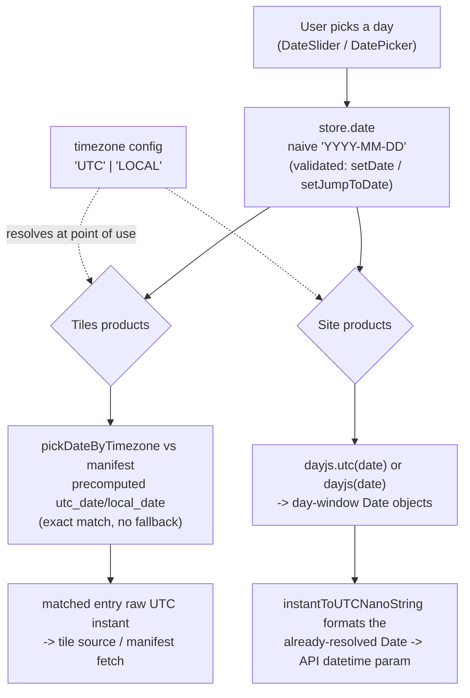

# Date/Time Design

How dates and timezones flow through IMOS Live: the naive-date convention, the
`timezone` config, and how each data source (tiles, sites) resolves a selected
calendar day against it.

## Core principle

**One naive `"YYYY-MM-DD"` string is the single source of truth for "the
selected day."** It carries no timezone information by design — the app only
tracks day granularity, never a specific instant, for anything the user
selects. Every consumer that needs an actual instant (to query an API, to
compare against UTC timestamps) resolves that naive string against the live
`timezone` setting **at the point of use**. Nothing upstream of that point
bakes a timezone interpretation into the stored value.

This keeps the "what day is selected" state (`store.date`) stable across a
timezone switch — flipping UTC ↔ LOCAL never changes _which calendar day_ is
selected, only _which instant range_ that day now resolves to for each data
source.

## The `timezone` config

```ts
export type TIMEZONE = 'UTC' | 'LOCAL';
```

`src/store/useMapUIStore.ts:36`

- Default: `INITIAL_TIMEZONE: TIMEZONE = 'UTC'` (`src/constants/mapInitialState.ts:17`).
- Lives in `useMapUIStore` as `timezone`, changed via `setTimezone`, surfaced
  to the user via the "Timezone selection" dropdown in
  `src/components/FeaturesMenu/MapsSection.tsx`.
- `'LOCAL'` means the browser's actual local timezone (`dayjs()`/`Date`
  without `.utc()`) — not a separately configurable zone.

## The naive-date contract

- **DateSlider** (`src/components/DateSlider`) enforces this at the type
  level: `min`/`max`/`value`/`setDateTime` are all typed `NaiveDateTime`
  (a plain string, never `Date`), and its internal parser throws on a `Z`
  suffix or a `±hh:mm` offset. See `DateSlider/README.md` § Timezone model.
- **`store.date`** (`useMapUIStore.ts`) is `string`. Both setters that write
  it assert the naive format and throw otherwise:
  - `setDate` — `useMapUIStore.ts:97-100`
  - `setJumpToDate` — `useMapUIStore.ts:135-138`
  - via `assertNaiveDateString` (`useMapUIStore.ts:167-171`), backed by
    `isNaiveDateString` (`src/utils/dateUtils.ts:95-97`, strict
    `dayjs(date, 'YYYY-MM-DD', true)` parsing — rejects offsets, wrong
    format, and invalid calendar dates like `2026-13-40`).
  - **Known gap:** `zustand/persist`'s URL rehydration
    (`src/store/urlSync.ts`, `date: strCodec`) restores `date` directly into
    the store's initial state on load, bypassing `setDate` — a hand-edited
    `?date=` URL param isn't validated at that entry point. In practice
    `useDateSliderDates`'s range clamp (below) will almost always snap a
    malformed value back to "today," but it isn't a hard guarantee.
- **DatePicker** (`src/components/DatePicker`) also operates on naive
  `NaiveDateTime` strings throughout, matching DateSlider's convention
  exactly, including its **exclusive `max`** (see below).

## Date range & "today"

`DATE_RANGE` (`src/constants/mapInitialState.ts:21-29`):

```ts
export const DATE_RANGE = {
  start: '2024-01-01',
  end: utcToTimezoneString(new Date(), INITIAL_TIMEZONE),
};
```

- `start` is a fixed constant — timezone doesn't affect it.
- `end` is "today," which **does** depend on timezone: UTC-today and
  local-today can be different calendar days near a day boundary. The value
  above is only a load-time snapshot for `INITIAL_TIMEZONE`, used solely to
  seed `INITIAL_DATE` (the store's initial default).
- The live picker/slider bound is **not** read from that snapshot. It comes
  from `useDateSliderDates` (`src/hooks/common/useDateSliderDates.ts`), which
  reads the current `timezone` from the store and re-derives `today`/`endDate`
  via `utcToTimezoneString(new Date(), timezone)` inside a `useMemo` keyed on
  `timezone` — so toggling UTC ↔ LOCAL at runtime immediately shifts the
  selectable range. `endDate` is exclusive (one day past the last selectable
  day); `DatePicker`'s `max` and `DateSlider`'s `max` both take this same
  exclusive value (`DatePicker.tsx`'s `buildAvailability` steps it back a day
  internally — `DatePicker.tsx:201-205` — mirroring DateSlider's own
  `minusOneUTCDay` handling of the identical convention in
  `DateSlider/hooks/useHandlePosition.ts`).

## Tiles products (GSLA current, GSLA anomaly, SST mosaic, SSTA mosaic, MCS category)

The manifest's `available_dates` are UTC instants. Enabling a tiles product
for the selected day means resolving that naive day against `timezone`, then
finding the manifest entry whose UTC-or-local calendar day matches it
**exactly** — not nearest-date.

1. `normaliseDate` (`src/api/tiles.ts:45-51`) precomputes, per manifest
   entry, both calendar-day readings from the raw UTC instant:
   `utc_date` via `utcToDateOnly` (`dateUtils.ts:39`), `local_date` via
   `utcToLocalDateTime` (`dateUtils.ts:25`).
2. `pickDateByTimezone(normalisedDate, timezone)` (`src/api/tiles.ts:38-40`)
   picks whichever of those two matches the app's current frame.
3. `useProductDateAvailabilitySync(product, date)`
   (`src/hooks/layers/useProductDateAvailabilitySync.ts`) does
   `p.available_dates.find(d => pickDateByTimezone(d, timezone) === date)`
   — an exact-string match against the naive selected day. If nothing
   matches, `isDateAvailable` is `false` and `productError` is set — **no
   fallback to the nearest available date.**
4. On a match, the matched entry's _raw UTC instant_ (not the naive day)
   becomes `requestDate`, which is what actually gets sent to the tile
   source/manifest fetch (`src/hooks/layers/useAtlasLayer.ts:77-98,106-107`).

All five tiles products share this path: `useParticleAtlasLayer` (GSLA
current) and `useScalarAtlasLayer` (the other four) both delegate to the
shared `useAtlasLayer`. The same `pickDateByTimezone` resolution is reused
independently for point-click popups
(`src/components/MapComponent/ClickedMapPopupContent.tsx`).

## Site products (Wave Buoys, Mooring Timeseries)

`src/api/site.ts` documents its own convention at the top of the file
(lines 15-32): outbound dates are always sent as UTC nanosecond strings;
naive calendar-day strings are resolved against `timezone` before
conversion.

- **`createGetSitesByDate`** (`site.ts:57-67`) — resolves the naive `date`
  directly: `timezone === 'UTC' ? dayjs.utc(date) : dayjs(date)`, then takes
  `.startOf('day')`/`.endOf('day')` _within that already-established frame_
  before converting to `Date` and formatting.
- **`createGetDetails`** (`site.ts:43-50`) — takes `from`/`to` as `Date`
  objects that the caller (`WaveBuoyChart.tsx`, `MooringChart.tsx`) has
  _already_ resolved the same way (`timezone === 'UTC' ? dayjs.utc(...) :
dayjs(...)`, then `.toDate()`). Both chart components build these
  independently but identically.
- **`instantToUTCNanoString`** (`dateUtils.ts:7-20`, formerly `localToUTC`) formats
  whatever it's given as the nanosecond-precision UTC string the site APIs'
  `datetime` param expects. On a `Date` input (every real call site above) it
  is purely a formatter — `dayjs(dateObj).utc()` re-expresses the same
  absolute instant, it does not re-interpret or shift it. The "interpret a
  naive local string" behavior in its signature (`string | Date`) is legacy
  generality: no current call site exercises it with a naive string, so
  there's no double-conversion risk despite the timezone resolution already
  having happened by the time it's called.
- **Minor known quirk:** `instantToUTCNanoString`'s default format hardcodes
  `.000000000[Z]` for the nanosecond portion regardless of the actual
  sub-second value, so `endOf('day')`'s true `23:59:59.999` gets truncated to
  `23:59:59.000000000` in the request — the end boundary is ~1 second short
  of true end-of-day. Harmless in practice given site data reports at best
  hourly.

## Summary flow



## Key utilities (`src/utils/dateUtils.ts`)

| Function                               | Purpose                                                                                                                                                                                             |
| -------------------------------------- | --------------------------------------------------------------------------------------------------------------------------------------------------------------------------------------------------- |
| `isNaiveDateString`                    | Strict `yyyy-mm-dd` validator (used to guard `store.date` writes).                                                                                                                                  |
| `naiveToUTCDate`                       | Parse a naive string into a `Date`, imposing a UTC interpretation on it. Throws on `Z`/offset input — unlike `utcToDateOnly`, this expects input that is NOT already a resolved UTC instant.        |
| `naiveToDateOnly`                      | Slice the `yyyy-mm-dd` portion off a naive datetime string (no parsing — distinct from `utcToDateOnly`, which parses and validates a real UTC instant).                                             |
| `utcToTimezoneString`                  | Format a UTC instant in the given `timezone` frame (`'UTC'` keeps it as-is, `'LOCAL'` converts to browser-local). Used for all "what calendar day is 'now'/this instant in this frame" derivations. |
| `utcToDateOnly` / `utcToLocalDateTime` | The UTC/local halves `utcToTimezoneString` dispatches to; also used directly by `normaliseDate` to precompute both readings once per manifest entry.                                                |
| `instantToUTCNanoString`               | Format an already-resolved instant as the nanosecond UTC string the site APIs expect.                                                                                                               |
| `addUTCTime`                           | Add time units to a `Date`, operating purely on UTC components.                                                                                                                                     |
| `isWithinDaysBefore`                   | True when `a` falls within N days before `b`, inclusive on both ends.                                                                                                                               |

## Related component docs

- `src/components/DateSlider/README.md` — the naive-string contract in detail.
- `src/components/DatePicker/README.md` — range mode, `[min, max)` exclusive convention.
